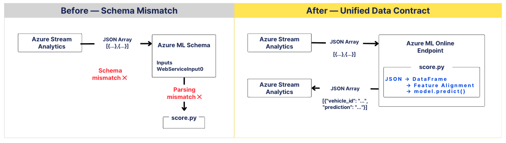

# Azure-based EV Battery Anomaly Detection & Monitoring System

> 전기차 배터리 주행 데이터를 활용하여 이상 징후를 탐지하고,
> Azure 기반 실시간 데이터 파이프라인과 모니터링 대시보드를 구축한 프로젝트입니다.


본 저장소는 팀 프로젝트 결과물 중 제가 핵심 담당한 **Azure ML 모델 배포 및 실시간 추론 연동을 중심**으로, 공동 참여한 LightGBM 이상 탐지 모델링과 BSI Feature 분석 과정을 함께 정리한 개인 포트폴리오입니다.

<br>

## 1. Project Overview

전기차 배터리는 전압, 전류, 온도, 충전 상태와 같은 여러 지표가 복합적으로 변화하기 때문에 단일 변수만으로 이상 상태를 판단하기 어렵습니다.

본 프로젝트에서는 전기차 배터리 데이터를 분석하여 이상 징후를 나타낼 수 있는 주요 Feature를 선정하고, 이를 기반으로 배터리 상태 지수인 **BSI(Battery Status Index)**를 설계했습니다.

또한 머신러닝 기반 배터리 이상 탐지 모델을 구축하고 Azure Machine Learning Endpoint로 배포하여, 실시간 데이터가 입력되면 배터리 상태를 예측할 수 있는 End-to-End 모니터링 시스템을 구현했습니다.

### Project Goal

* 배터리 이상 징후와 관련된 주요 Feature 탐색 및 선정
* Z-score 기반 BSI(Battery Status Index) 설계
* 정상·주의·위험 상태를 분류하는 이상 탐지 모델 개발
* Azure Machine Learning을 활용한 모델 배포
* Azure IoT Hub부터 Power BI까지 연결되는 실시간 모니터링 파이프라인 구현

<br>

## 2. Architecture


<br>

## 3. My Role

| 영역 | 기여 형태 | 담당 내용 |
|---|---|---|
| BSI Feature Selection | 공동 작업 (3인) | 배터리 이상 판단을 위한 후보 Feature 분석 및 선정 |
| BSI 설계 | 팀 공동 | 이상 지표 정의 및 BSI 산식 설계 참여 |
| LightGBM Modeling | 공동 작업 (2인) | 이상탐지 모델 학습·평가 및 개선 |
| Azure ML Deployment | **개인 핵심 담당** | 모델 배포, score.py 작성/수정, Endpoint 구성 및 ASA 연동 |

<br>

## 4. Azure ML Real-time Serving ⭐
> Primary Owner 

학습된 LightGBM 이상 탐지 모델을 Azure ML Online Endpoint로 배포하고, Azure Stream Analytics와 연결하여 실시간 추론이 가능한 Serving Flow를 구현했습니다.

### 주요 작업
- Azure ML Managed Online Endpoint 기반 LightGBM 모델 배포
- 실시간 추론을 위한 `score.py` 및 Input/Output Schema 구성
- Azure Stream Analytics UDF ↔ Azure ML Endpoint 연동
- ASA–Azure ML Schema 불일치 분석 및 실시간 추론 정상화

<br>

### 4-1.  Deployment Flow


① ASA에서 Telemetry Feature 추출  
② Azure ML Online Endpoint 호출  
③ score.py에서 JSON → DataFrame 변환  
④ 학습 Feature 기준으로 입력 정렬  
⑤ LightGBM inference  
⑥ Prediction JSON 반환

<br>

### 4-2. Inference Implementation
ASA에서 전달된 JSON Array를 모델 입력 형태로 변환하고, 학습 시 사용한 Feature Schema에 맞춰 추론한 뒤 Prediction JSON을 반환하도록 score.py를 구성했습니다.

```python
# ----------------------------------
# Parse ASA / Azure ML request
# ----------------------------------
if isinstance(raw_data, dict) and "Inputs" in raw_data:
    records = raw_data["Inputs"]["WebServiceInput0"]
elif isinstance(raw_data, dict) and "WebServiceInput0" in raw_data:
    records = raw_data["WebServiceInput0"]
elif isinstance(raw_data, list):
    records = raw_data
else:
    records = [raw_data]

df = pd.DataFrame(records)

```

```python
# ----------------------------------
# Align inference features with the training schema
# ----------------------------------
feature_df = make_features(df).copy()

model_input_df = feature_df.rename(columns={
    "battery_voltage": "voltage",
    "battery_current": "current",
    "temperature": "battery_temp"
})

X_pred = model_input_df[MODEL_FEATURE_COLS].copy()

for col in X_pred.columns:
    X_pred[col] = pd.to_numeric(X_pred[col], errors="coerce")

X_pred = X_pred.fillna(0)

# ----------------------------------
# Run inference
# ----------------------------------
proba = model.predict_proba(X_pred)

preds = []
for p in proba:
    if p[danger_idx] >= danger_threshold:
        preds.append(int(classes_[danger_idx]))
    else:
        preds.append(int(classes_[np.argmax(p)]))

# ----------------------------------
# Return prediction response
# ----------------------------------
feature_df["predicted_label"] = preds
feature_df["status"] = feature_df["predicted_label"].map({
    0: "NORMAL",
    1: "WARNING",
    2: "CRITICAL"
})

result_df = feature_df[result_cols].copy()

# ----------------------------------
# Return ASA-friendly record array
# ----------------------------------
return result_df.to_dict(orient="records")

```
전체구현: [`deployment/score.py`](./deployment/score.py)

<br>

### 4-3. Troubleshooting

ASA와 Azure ML Endpoint 간 Input Schema 불일치

#### ① Problem
Azure ML에서 생성된 schema/decorator가 기대하는 입력 형식과
Stream Analytics에서 UDF를 통해 전달하는 JSON 구조가 일치하지 않아
Endpoint 호출에 실패했습니다.



#### ② Investigation
- Azure ML schema 확인
- decorator 기반 입력 구조 테스트
- ASA UDF 요청 payload 확인
- score.py 입력 데이터 구조 추적

#### ③ Solution
- `score.py`의 입력 파싱 로직을 수정하여 ASA에서 전달되는 JSON Array뿐 아니라 Azure ML Schema의 wrapper 구조도 처리할 수 있도록 입력 계약을 정리했습니다. 

- 파싱된 데이터를 DataFrame으로 변환한 뒤 학습 Feature Schema에 맞게 컬럼을 정렬하고, 추론 결과는 ASA가 후속 처리할 수 있는 record array 형태로 반환하도록 구성했습니다.

### 4-4. Result
- ASA ↔ Azure ML 간 Schema 불일치를 해결하고 실시간 추론 호출을 정상화했습니다.

- 입력 Parsing → Feature Alignment → LightGBM Inference → Prediction Response 흐름을 연결하여,

- IoT Hub → ASA → Azure ML Online Endpoint → ASA → Azure SQL로 이어지는 실시간 ML Serving Pipeline을 최종 구현했습니다.


<br>

## 5. LightGBM Anomaly Detection
> Team Contribution · 2 members

배터리 상태를 `Normal`, `Warning`, `Danger`로 분류하는 다중 분류 모델을 개발했습니다.
위에서 수립한 배터리 상태를 pseudo-label로 모델 학습에 사용했습니다.

위험 상태 데이터가 정상 데이터보다 적은 **불균형 데이터라는 점을 고려하여 전체 정확도보다 클래스별 Recall과 Macro F1-score를 중심으로** 모델을 평가했습니다.

### 주요 작업

* 학습 데이터와 평가 데이터 분리
* LightGBM 기반 다중 분류 모델 학습
* 클래스 불균형을 고려한 성능 평가
* Confusion Matrix를 활용한 오분류 분석
* Danger 클래스 탐지 성능 개선


### Model

```text
Algorithm : LightGBM Classifier
Task      : Multi-class Classification
Classes   : Normal / Warning / Danger
```

### Evaluation Metrics

```text
Macro F1-score : 0.7895
Danger Recall  : 0.8041
```

위험 상태를 정상 또는 주의 상태로 잘못 판단하는 경우 실제 운영 환경에서 안전 문제로 이어질 수 있기 때문에, 본 프로젝트에서는 **Danger Recall을 핵심 평가 지표로 설정했습니다.**

<br>

## 6. BSI & Feature Engineering
> Team Contribution · 3 members

배터리 이상 상태를 수치화하기 위한 BSI 공식에 사용할 Feature를 선정했습니다.

단순히 원본 변수를 사용하는 것이 아니라, 배터리 상태 변화와 이상 징후를 더 잘 표현할 수 있도록 파생변수와 시계열 통계값을 생성하고 비교했습니다.


### 주요 Feature

| Feature         | Description                |
| --------------- | -------------------------- |
| `delta_current` | 이전 시점 대비 전류 변화량            |
| `delta_voltage` | 이전 시점 대비 전압 변화량            |
| `abs_power`     | 전압과 전류를 이용한 절대 전력          |
| `temp_diff`     | 배터리 온도 간 편차                |
| `rolling_mean`  | 일정 구간의 이동 평균               |
| `z_score`       | 변수별 평균과 표준편차를 기준으로 계산한 이상도 |

### BSI Concept

각 Feature의 Z-score에 가중치를 적용하여 하나의 배터리 상태 지수로 통합했습니다.
가중치는 담당 팀원들이 NASA 전기배터리 실험 데이터로 추출하였습니다. 

```text
BSI
= w1 × Z(delta_current)
+ w2 × Z(delta_voltage)
+ w3 × Z(abs_power)
+ w4 × Z(temp_diff)
+ w5 × Z(rolling_feature)
```

BSI 점수와 주요 Feature의 변화 패턴을 활용하여 배터리 상태를 다음과 같이 구분했습니다.
BSI를 Z-정규화하여 규칙기반 배터리 상태를 정의했습니다. 

```text
Normal  | 정상 범위 |  Z(BSI) < 2sigma
Warning | 이상 징후가 관찰되는 상태 |  2sigma <= Z(BSI) < 3sigma 
Danger  | 즉각적인 확인이 필요한 위험 상태 |  Z(BSI) >= 3sigma
```


<br>

## 7. Tech Stack

### Language & Analysis


### Azure


### Visualization & Collaboration


<br>

## 8. Repository Structure

```text
Azure-based-Electric-Vehicle-EV-Battery-Anomaly-Detection-and-Monitoring-System
│
├── assets
│   ├── Model Development Flow.png
│   ├── Real-time ML Serving Flow — My Primary Contribution.png
|   |── Schema_contract_troubleshooting
│   └── System Architecture.png
│
├── deployment
│   ├── conda.yaml
│   ├── deployment.ipynb
│   └── score.py
│
├── modeling
│   └── lightgbm_modeling.ipynb
│ 
├── requirements.txt
└── README.md
```

<br>

## 9. Key Results

본 프로젝트에서는 배터리 이상 탐지 모델을 개발하고, 분석 결과를 실시간 데이터 파이프라인에서 활용할 수 있도록 **Azure ML Online Endpoint 기반의 추론 환경까지 연결**했습니다.

* 배터리 도메인 가설과 시계열 특성을 기반으로 이상 탐지 Feature 선정 및 BSI 설계
* 클래스 불균형을 고려한 LightGBM 이상 탐지 모델 개발 및 성능 평가
* **Azure Machine Learning Online Endpoint를 활용한 모델 배포**
* Stream Analytics에서 배포된 모델을 호출하는 **실시간 추론 흐름 구현**
* ASA와 Azure ML 간 입력 Schema 차이를 분석하고 `score.py`의 입력 처리 구조를 수정하여 **Endpoint 연동 오류 해결**
* 데이터 수집 → 이상 탐지 → 모델 추론 → 시각화로 이어지는 **End-to-End 서비스 구조 검증**

## 10. Next Steps

현재 구현은 프로젝트 환경에서 실시간 추론 흐름을 검증한 MVP 수준으로, 실제 운영 환경으로 확장하기 위해서는 다음과 같은 개선이 필요합니다.

* **Model Monitoring**: 입력 데이터 분포와 예측 결과를 모니터링하여 Data/Model Drift 탐지
* **Observability**: Endpoint 호출 실패, 응답 시간, 추론 오류 등에 대한 로그 및 모니터링 체계 구축
* **Resilience**: Endpoint 장애나 일시적인 API 오류에 대비한 Retry 및 예외 처리 정책 적용
* **Model Lifecycle**: 모델 버전 관리와 재학습·재배포 과정을 자동화하는 MLOps 파이프라인 구축
* **Data Validation**: 실시간 입력 데이터의 Schema 및 품질 검증을 추가하여 비정상 데이터의 모델 유입 방지

이를 통해 현재의 **실시간 이상 탐지 MVP를 모델 배포 이후의 모니터링·장애 대응·재배포까지 고려한 운영 가능한 ML Serving 구조로 확장**할 수 있습니다.
